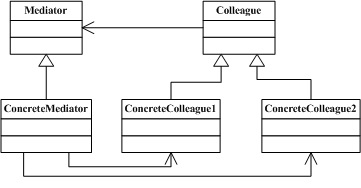

## 1．创建型模式
前面讲过，社会化的分工越来越细，自然在软件设计方面也是如此，因此对象的创建和对象的使用分开也就成为了必然趋势。因为对象的创建会消耗掉系统的很多资源，所以单独对对象的创建进行研究，从而能够高效地创建对象就是创建型模式要探讨的问题。这里有6个具体的创建型模式可供研究，它们分别是：
- [工厂方法模式（Factory Method）](src/factory_method)
	- 定义一个用户创建对象的接口，让子类决定实例化哪一个类，工厂方法模式使一个类的实例化延迟到其子类。
	- 类不知道自己要创建哪一个对象时,类用它的子类来指定创建哪个对象
- [抽象工厂模式（Abstract Factory）](src/abstract_factory)
	- 提供一个创建一系列相关或相互依赖对象的接口，而无须指定他们具体的类。
	- 工厂方法把生产产品的方式封装起来了，但是一个工厂只能生产一类对象，当一个工厂需要生产多类产品的时候，就需要使用抽象工厂了。
- [创建者模式（Builder）](src/Builder)
	- 在软件系统设计中，有时候面临着一个“复杂系统”的创建工作，该对象通常由各个部分的子对象用一定的算法构成，或者说按一定的步骤组合而成；这些的算法和步骤是稳定的，而构成这个对象的子对象却经常由于需求改变而发生变化。
	- 生活中有许多这方面的例子，譬如安装一台电脑，他的组装过程基本上是不变的，都可以由主板，CPU，内存等按照某个稳定方式组合而成。然而，主板、CPU和内存等零件，本身都是可能多变的，这就适用于Builder模式。
- [原型模式（Prototype）](src/prototype)
	- 用原型实例指定创建对象的种类，并且通过拷贝这些原型创建新的对象。
	- Prototype模式使用原型实例指定创建对象的种类。新产品的原型通常是先于全部产品建立的，这样的原型是被动的，并不参与复制它自己。一个细胞的有丝分裂，产生两个同样的细胞，是一个扮演主动角色复制自己原型的例子，这演示了原型模式。一个细胞分裂，产生两个同样基因型的细胞。换句话说，细胞克隆了自己。
- [单例模式（Singleton）](src/singleton)
	- 单例模式是一种常用的软件设计模式。在它的核心结构中只包含一个被称为单例类的特殊类。通过单例模式可以保证系统中一个类只有一个实例而且该实例易于外界访问，从而方便对实例个数的控制并节约系统资源。

## 2．结构型模式
在解决了对象的创建问题之后，对象的组成以及对象之间的依赖关系就成了开发人员关注的焦点，因为如何设计对象的结构、继承和依赖关系会影响到后续程序的维护性、代码的健壮性、耦合性等。对象结构的设计很容易体现出设计人员水平的高低，这里有7个具体的结构型模式可供研究，它们分别是：
- [外观模式（Facade）](src/facade)
	- 外部与一个子系统的通信必须通过一个统一的门面(Facade)对象进行，这就是门面模式。
	- 门面模式提供一个高层次的接口，使得子系统更易于使用。就如同医院的接待员一样，门面模式的门面类将客户端与子系统的内部复杂性分隔开，使得客户端只需要与门面对象打交道，而不需要与子系统内部的很多对象打交道。
- [适配器模式（Adapter）](src/adapter)
	- 将一个类的接口转换成客户希望的另外一个接口。Adapter模式使得原本由于接口不兼容而不能一起工作的那些类可以一起工作。
- [代理模式（Proxy）](src/proxy)
	- 代理（Proxy）模式给某一个对象提供一个代理，并由代理对象控制对原对象的引用。
- [装饰模式（Decorator）](src/decorator)
	- 动态地给一个对象添加一些额外的职责。就增加功能来说，Decorator模式相比生成子类更为灵活。
- [桥模式（Bridge）](src/bridge)
	- 将抽象部分与实现部分分离，使它们都可以独立的变化。
	 
    (*注解：NImpLog（.net平台）  JImpLog(java平台)*) 
    Log只需要对ImpLog的接口进行编程，当有新的平台log时，只需要实现新的ImpLog传递给Log就可以完成新的平台Log
- [组合模式（Composite）](src/composite)
	- 将对象组合成树形结构以表示“部分-整体”的层次结构。Composite模式使得用户对单个对象和组合对象的使用具有一致性。
	- 这里我们用绘图这个例子来说明Composite模式，通过一些基本图像元素（直线、圆等）以及一些复合图像元素（由基本图像元素组合而成）构建复杂的图形树。在设计中我们对每一个对象都配备一个Draw()方法，在调用时，会显示相关的图形。可以看到，这里复合图像元素它在充当对象的同时，又是那些基本图像元素的一个容器。
- [享元模式（Flyweight）](src/flyweight)
	- 如果个应用程序使用了大量的对象，而这些对象造成了**很大的存储开销**并且这些**对象都可以归纳成有限的种类**的时候就可以考虑是否可以使用享元模式。

## 3．行为型模式
在对象的结构和对象的创建问题都解决了之后，就剩下对象的行为问题了，如果对象的行为设计的好，那么对象的行为就会更清晰，它们之间的协作效率就会提高，这里有11个具体的行为型模式可供研究，它们分别是：
- [模板方法模式（Template Method）](src/template_method)
	- 模板方法模式定义一个操作中的算法的骨架，而将一些步骤延迟到子类中。Template Method使得子类可以不改变一个算法的结构即可重定义该算法的某些特定步骤。
- [观察者模式（Observer）](src/observer)
	-  在软件构建 过程中，我们需要为某些对象建立一种“通知依赖关系” --一个对象（目标对象）的状态发生改变，所有的依赖对象（观察者对象）都将得到通知 
- [状态模式（State）](src/state)
	- 把所有动作都封装在状态对象中，状态持有者将行为委托给当前状态对象
	- 假设我们要模拟一个ATM机,
		- 首先找出ATM提供的所有接口
           1. 插卡
           2. 提交密码
           3. 取款（假设取款按钮是物理键）
           4. 查询（假设同上）
           5. 取卡
		- 分为三种状态
			- 准备就绪（Ready）：可用1,2,3,4,5全部接口，需要实现
			- 无钞（NoCash）：可用1，2，4，5接口，需要实现
			- 故障（NoService）：可用接口：无
- [策略模式（Strategy）](src/strategy)
	- 策略模式的用意是针对一组算法，将每一个算法封装到具有共同接口的独立的类中，从而使得它们可以相互替换。策略模式使得算法可以在不影响到客户端的情况下发生变化。
	- 多个类只区别在表现行为不同，可以使用Strategy模式
	- 假设现在要设计一个贩卖各类书籍的电子商务网站的购物车（Shopping Cat）系统。比如，本网站可能对所有的教材类图书实行每本一元的折扣；对连环画类图书提供每本7％的促销折扣，而对非教材类的计算机图书有3％的折扣；对其余的图书没有折扣。由于有这样复杂的折扣算法，使得价格计算问题需要系统地解决。
- [职责链模式（Chain of Responsibility）](src/chain_of_responsibility)
	- 使多个对象都有机会处理请求，从而避免请求的发送者和接受者之间的耦合关系。将这个对象连成一条链，并沿着这条链传递该请求，直到有一个对象处理他为止。
- [命令模式（Command）](src/command)
	- 将一个请求封装为一个对象，从而使你可用不同的请求对客户进行参数化；对请求排队或记录请求日志，以及支持可撤消的操作。
- [访问者模式（Visitor）](src/visitor)
	- 访问者模式的目的是封装一些施加于某种数据结构元素之上的操作。一旦这些操作需要修改的话，接受这个操作的数据结构则可以保持不变。
- [调停者模式（Mediator）](src/mediator)
	- 对象之间存在复杂的引用关系，当需求更改时，对系统进行修改将会非常困难。为了对系统的对象进行解耦，可以引入一个间接层来管理对象之间的关系，这就是中介者模式。
	
- [备忘录模式（Memento）](src/memento)
	- 在不破坏封装的前提下，捕获一个对象的内部状态，并在该对象之外保存这个状态，这样以后就可以把该对象恢复到原先的状态。
- 迭代器模式（Iterator）；
- 解释器模式（Interpreter）；

- - -
感谢 https://github.com/monochromegane/go_design_pattern

